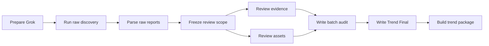
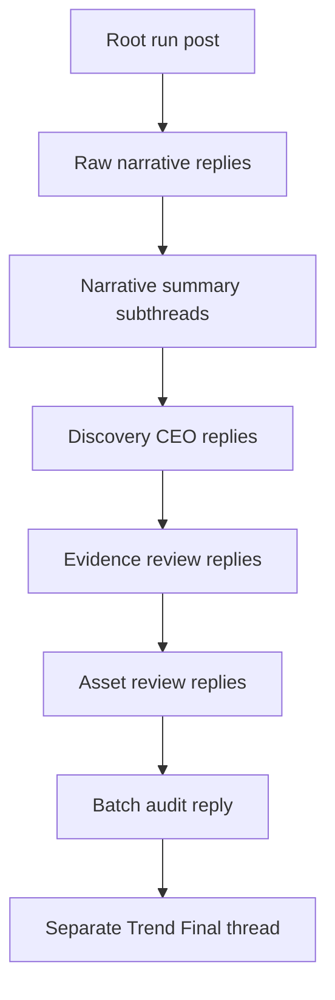

# Step 1 Orchestration

## Why orchestration exists

Stage 1 orchestration exists to turn a raw scan into a reviewable batch with:

- clear owners
- clear join gates
- a clean Step 2 handoff
- a public X trust surface

Without orchestration, Stage 1 becomes a long browser run with no reliable
decision boundary.

## Core roles

- `session-keeper`
- `trend-scout`
- `narrative-normalizer`
- `discovery-ceo`
- `evidence-reviewer`
- `asset-reviewer`
- `batch-auditor`
- `finalizer`
- optional `public narrator`

## Internal flow

## Public X flow

When public logging is enabled, Stage 1 also narrates itself in public on X.

## Execution order

1. prepare Grok
2. start raw discovery lanes
3. emit the root X run post for each lane when public logging is enabled
4. emit one raw narrative reply as soon as a raw lane finishes
5. parse the raw reports
6. freeze `review-scope.md`
7. emit one narrative summary subthread per approved narrative
8. emit one Discovery CEO reply inside each approved narrative subthread
9. review evidence and assets for approved narratives
10. emit evidence and asset replies when public logging is enabled
11. write `batch-audit.md`
12. emit one batch audit reply
13. write `trend-final.md`
14. build `trend-package/`
15. emit one separate top-level Trend Final thread

## What runs in parallel

- `global` and `ai` lanes can run in parallel
- Stage 1 X run posts and raw replies can now happen while other lanes are
  still scanning
- approved narratives can be reviewed in parallel
- approved narrative X subthreads can progress in parallel after scope freeze
- public X posting now runs as an ordered async mirror queue, so internal review
  does not have to stop and wait for every live X action

## What is still serialized

- the runtime still uses one shared browser context
- clipboard work is still serialized
- evidence review still happens before asset review inside the same narrative
- X post order is still serialized on purpose so reply chains stay clean

## Join gates

Batch audit should not start until:

- `review-scope.md` exists
- approved narratives have completed the available internal reviews
- public narrative summary, CEO, evidence, and asset replies are either posted
  or explicitly skipped when public logging is enabled

Trend Final should not be published until:

- `batch-audit.md` exists
- the batch-audit X reply is either posted or explicitly skipped when public
  logging is enabled

Step 2 should not start until:

- `trend-final.md` exists
- `trend-package/` exists

## Output contract

Stage 1 orchestration is complete only when it produces:

- `review-scope.md`
- `*.evidence-review.md`
- `*.asset-review.md`
- `batch-audit.md`
- `trend-final.md`
- `trend-package/`
- optional `x-public-log.json`
- optional `x-public-log.md`

## Internal vs public surface

The internal batch is the real data layer for Step 2.

The X flow is the public trust layer. It exists so external followers can see
what the AI is scanning, rejecting, and promoting in near real time.

Public posting should never replace the internal handoff package.
