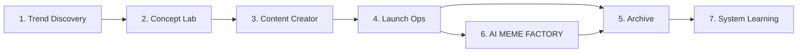

# Campaign Walkthrough

Trang này dùng để nhìn MEME LABS như một chiến dịch sống hoàn chỉnh, thay vì đọc từng stage rời nhau.

## Một campaign đi qua hệ thống như thế nào

## Câu chuyện thật sự của một campaign

### 1. Hệ thống đi tìm story đáng đánh

Campaign bắt đầu không phải từ ticker, mà từ một batch narrative.

Hệ thống sẽ:

- quét trend
- tách trend thành narrative
- gom evidence
- đọc asset
- chốt narrative nào đáng đi tiếp

Kết quả của đoạn này là một gói bàn giao đủ rõ cho người làm concept.

### 2. Hệ thống chốt coin này là ai

Từ narrative thắng cuộc, MEME LABS tạo ra:

- thesis
- ticker
- lore
- mascot
- tone
- launch angle

Đây là nơi coin có bản sắc.

### 3. Hệ thống biến concept thành attention engine

Sau khi concept đã khóa, hệ thống dựng:

- post mở màn
- thread
- reply pack
- identity trên X
- visual direction
- mascot board hoặc short direction

Lúc này coin không còn là idea. Nó bắt đầu có hình dạng công khai.

### 4. Hệ thống launch coin thật

Launch diễn ra ở đây.

Nhưng quan trọng hơn việc launch là:

- ghi lại fact
- đọc phản ứng ban đầu
- chốt xem coin có đáng nuôi tiếp hay không

### 5. Nếu coin còn sống, hệ thống cho công chúng thấy AI đang tự chạy

Đây là AI MEME FACTORY.

Trong loop này, hệ thống:

- chạy burst đầu
- đo reaction
- quyết định nurture hay stop

Nó vừa là public proof, vừa là data engine cho các vòng học sau.

### 6. Hệ thống đóng hồ sơ chiến dịch

Bất kể coin thắng hay thua, campaign phải được archive.

Lúc này MEME LABS viết lại:

- campaign summary
- postmortem
- reuse notes

Đây là nơi campaign trở thành kiến thức.

### 7. Hệ thống học lại chính mình

Cuối cùng, những gì vừa diễn ra sẽ được đưa vào một vòng learning:

- xác định lỗi lặp lại
- viết patch plan
- chọn patch thắng
- vá workflow hoặc skill

Đây là thứ khiến campaign sau tốt hơn campaign trước.

## Nhìn chiến dịch theo artifact

| Giai đoạn | Artifact chính | Ý nghĩa |
| --- | --- | --- |
| Step 1 | `.narrative/.../step1-handoff.md` | Gói trend đã sẵn sàng để chọn winner |
| Step 2 | `.concepts/[TICKER]/concept.md` | Bản sắc chính thức của coin |
| Step 3 | `.campaigns/[TICKER]/content-system/` | Bộ content sẵn sàng để launch |
| Step 4 | `.campaigns/[TICKER]/launch/` | Hồ sơ launch và decision sau launch |
| Step 5 | `.campaigns/[TICKER]/` | Hồ sơ chiến dịch đã được đóng gói |
| Step 6 | `.campaigns/[TICKER]/ai-meme-factory/` | Hồ sơ public loop trên X |
| Step 7 | `.agents/evals/...` | Hồ sơ học lại của hệ thống |

## Điều làm một campaign tốt

Một campaign tốt không phải là campaign có nhiều file.

Nó là campaign mà:

- mỗi stage đều có quyết định rõ
- mỗi quyết định đều để lại dấu vết
- người đến sau đọc hồ sơ vẫn hiểu chuyện gì đã xảy ra
- bài học cuối cùng quay trở lại cải thiện hệ thống

## Nếu chỉ có 10 phút để review

Hãy đọc theo thứ tự:

1. [Tổng quan pipeline](/docs/stages/overview)
2. [Narrative Batches](/docs/outputs/narrative-batches)
3. [Concept Packages](/docs/outputs/concept-packages)
4. [Campaign Packages](/docs/outputs/campaign-packages)
5. [Evaluation Packs](/docs/outputs/evaluation-packs)

Nếu có nhiều thời gian hơn, đi tiếp vào từng trang stage.
