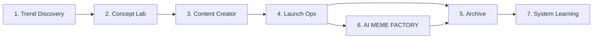

# Campaign Walkthrough

Trang này dùng để nhìn toàn bộ MEME LABS như một vòng đời hoàn chỉnh, thay vì đọc từng stage rời nhau.

## Sơ đồ một campaign hoàn chỉnh

## Đọc nhanh theo 3 cách

| Nếu muốn hiểu... | Hãy nhìn vào... | Câu hỏi chính |
| --- | --- | --- |
| Luồng quyết định | Step 1 -> 2 -> 3 -> 4 | Mỗi bước chốt cái gì trước khi đi tiếp |
| Luồng artifact | `.narrative` -> `.concepts` -> `.campaigns` | Tài liệu nào được tạo ra và lưu ở đâu |
| Luồng học lại | Archive -> System Learning | Bài học nào quay lại cải thiện hệ thống |

## Step 1: Trend Discovery

### Mục tiêu

Tạo ra một batch narrative đủ tốt để chọn winner.

### Artifact chính

- narrative batch trong `.narrative/`

## Step 2: Concept Lab

### Mục tiêu

Chọn đúng một narrative và khóa nó thành concept coin.

### Artifact chính

- concept package trong `.concepts/[TICKER]/`

## Step 3: Content Creator

### Mục tiêu

Biến concept thành content system có thể đi ra công khai.

### Artifact chính

- content package trong `.campaigns/[TICKER]/content-system/`

## Step 4: Launch Ops

### Mục tiêu

Launch token thật và ghi lại reaction thật.

### Artifact chính

- launch package trong `.campaigns/[TICKER]/launch/`

## Step 5: Archive

### Mục tiêu

Biến campaign thành package có thể audit và học lại.

### Artifact chính

- campaign package trong `.campaigns/[TICKER]/`

## Step 6: AI MEME FACTORY

### Mục tiêu

Cho cộng đồng thấy hệ thống đang tự vận hành thật trên X.

### Artifact chính

- loop package trong `.campaigns/[TICKER]/ai-meme-factory/`

## Step 7: System Learning

### Mục tiêu

Đưa bài học ngược trở lại control plane của MEME LABS.

### Artifact chính

- evaluation pack trong `.agents/evals/YYYYMMDD-HHmm-scope/`

## Cách review cả hệ thống nhanh nhất

Nếu muốn review một vòng campaign hoàn chỉnh, đọc theo thứ tự:

1. [Tổng quan pipeline](/docs/stages/overview)
2. [Narrative Batches](/docs/outputs/narrative-batches)
3. [Concept Packages](/docs/outputs/concept-packages)
4. [Campaign Packages](/docs/outputs/campaign-packages)
5. [Evaluation Packs](/docs/outputs/evaluation-packs)

## Điều quan trọng nhất

MEME LABS không mạnh vì có nhiều skill. Nó mạnh nếu mỗi bước đều để lại artifact rõ ràng, có owner rõ ràng, và có decision rõ ràng.
