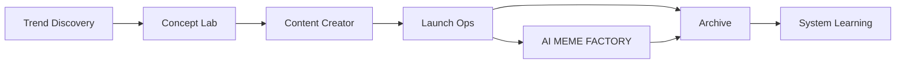

# Campaign Walkthrough

Each campaign should feel like one tracked object, not a chain of forgotten
folders.

## Lifecycle

## What the Control Room should show

- current stage
- current owner
- blockers
- next action
- trust links
- artifact refs

## What a good campaign looks like

- one clear winner
- clean stage contracts
- no silent handoffs
- archive and learning both completed
