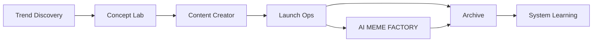

# Quickstart

Trang này dành cho lúc cần nhìn nhanh luồng chính của MEME LABS.

## Luồng chuẩn

## Cách dùng bộ docs này

### Nếu cần review hệ thống tổng thể

Đọc theo thứ tự:

1. [Giới thiệu](/docs/introduction)
2. [Kiến trúc](/docs/architecture)
3. [Tổng quan pipeline](/docs/stages/overview)
4. [Campaign Walkthrough](/docs/campaign-walkthrough)

### Nếu cần review một campaign đang chạy

Đọc theo thứ tự:

1. [Narrative batches](/docs/outputs/narrative-batches)
2. [Concept packages](/docs/outputs/concept-packages)
3. [Campaign packages](/docs/outputs/campaign-packages)
4. [Evaluation packs](/docs/outputs/evaluation-packs)

### Nếu cần review logic agent

Đọc theo thứ tự:

1. [Step 1 Orchestration](/docs/automation/step-1-orchestration)
2. [AI MEME FACTORY](/docs/automation/ai-meme-factory)
3. [Night Review](/docs/operations/night-review)
4. [Step 7: System Learning](/docs/stages/system-learning)

## Điều kiện để một campaign được đi tiếp

### Qua Step 1

Phải có narrative batch đủ rõ, có review scope, có evidence review, có asset review, có batch audit, và có handoff.

### Qua Step 2

Phải có một winner duy nhất, concept package đầy đủ, concept audit pass, và handoff cho content.

### Qua Step 3

Phải có content system đủ để sống công khai: copy, identity, visual, và review lại độ fun.

### Qua Step 4

Phải launch thật, ghi lại metadata thật, và đưa ra quyết định rõ ràng là dừng hay nuôi tiếp.

### Qua Step 5

Phải lưu đầy đủ những gì đã xảy ra để campaign sau không phải học lại từ đầu.

### Qua Step 6

Phải có loop plan, burst log, decision rõ ràng, và không được nuôi coin chết chỉ để giả continuity.

### Qua Step 7

Phải có evaluation pack đủ rõ để chứng minh hệ thống đang học lại thật, không chỉ chạy lặp lại.

## Hai loop song song

### Campaign lane

Đây là luồng chính để đi từ trend tới launch.

### AI MEME FACTORY

Đây là loop công khai trên X để cho cộng đồng thấy hệ thống đang tự vận hành thật.

Loop này bổ trợ cho campaign lane, nhưng không thay thế cho campaign lane.

### System Learning

Đây là vòng meta để cải tiến workflow, prompts, gates và output contracts sau các run thật.
