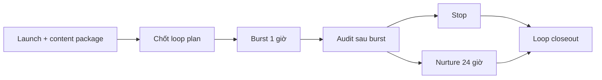

# Step 6: AI MEME FACTORY

## Nhìn nhanh

| Thành phần | Nội dung |
| --- | --- |
| Mục tiêu | Chạy loop công khai trên X sau launch |
| Decision owner | AI Meme Factory Commander |
| Input chính | Launch package, content package, public rules |
| Output khóa | `loop-plan.md`, `burst-log.md`, `loop-decision.md` |

## Sơ đồ luồng



## Step này tồn tại để làm gì

Step 6 là public loop của MEME LABS.

Nó tồn tại để:

- cho cộng đồng thấy hệ thống đang tự vận hành thật
- tận dụng attention còn sống của coin
- tạo thêm dữ liệu social cho archive và system learning

Đây không phải phần thay thế main campaign lane. Nó là một loop song song sau launch.

## Input của Step 6

Step 6 thường cần:

- launch package
- content package
- public rules của AI MEME FACTORY

## AI sẽ làm gì

### 1. Chốt loop plan

AI phải quyết định:

- coin này có nên vào public loop hay không
- trong 1 giờ đầu sẽ bắn loại content nào
- nếu coin sống thì 24 giờ tiếp theo sẽ nuôi kiểu gì
- điều kiện nào khiến phải dừng ngay

### 2. Chạy burst 1 giờ đầu

Đây là giai đoạn chứng minh coin có còn đà hay không.

AI phải ghi lại:

- đã post những gì
- phản ứng nào xuất hiện
- cộng đồng có bám vào story không

### 3. Audit sau burst

Sau 1 giờ, AI không được tiếp tục theo quán tính.

Nó phải review:

- attention có thật không
- community có phản ứng không
- content có còn tạo lực kéo không
- coin có đáng nuôi thêm không

### 4. Nếu đạt thì chạy nurture

Chỉ những coin vượt qua gate sau burst mới được nuôi tiếp.

Giai đoạn này tập trung vào:

- giữ câu chuyện sống
- làm community thấy hệ thống đang tự vận hành
- kéo dài lifespan của campaign

### 5. Nếu không đạt thì dừng

Dừng cũng là một quyết định đúng.

AI phải ghi lý do dừng rõ ràng, không kéo một coin chết chỉ để làm đẹp chỉ số hoạt động.

### 6. Viết closeout của loop

Cuối Step 6 phải có kết luận:

- loop này thành công hay không
- vì sao
- để lại bài học gì cho archive và system learning

## Output của Step 6

Toàn bộ output được lưu trong:

```text
.campaigns/[TICKER]/ai-meme-factory/
```

Với các file:

- `loop-plan.md`
- `burst-log.md`
- `nurture-log.md`
- `loop-decision.md`
- `step6-closeout.md`

## Mỗi file dùng để làm gì

### `loop-plan.md`

Khóa kế hoạch vận hành public loop.

### `burst-log.md`

Ghi lại 1 giờ đầu.

### `nurture-log.md`

Ghi lại giai đoạn nuôi tiếp nếu coin sống.

### `loop-decision.md`

Là file chốt decision nuôi tiếp hay dừng.

### `step6-closeout.md`

Là file đóng hồ sơ cho public loop này.

## Khi nào Step 6 được xem là xong

Step 6 chỉ được xem là hoàn tất khi:

1. loop plan đã được khóa
2. burst đã có log
3. nurture đã có log hoặc có lý do không chạy
4. loop decision đã rõ
5. closeout đã hoàn tất

## Dấu hiệu Step 6 đang làm chưa tốt

- tiếp tục post dù coin đã chết
- không ghi được vì sao coin còn đáng nuôi
- log quá ít, không phản ánh public loop thật
- loop chỉ là spam content chứ không phải orchestration có chủ đích

## Bàn giao cho bước sau

Step 6 tạo ra bài học social và attention. Những bài học này phải quay lại Archive và System Learning.

## Đọc thêm

- [AI MEME FACTORY Logic](/docs/automation/ai-meme-factory)
- [Step 5: Archive](/docs/stages/archive)
