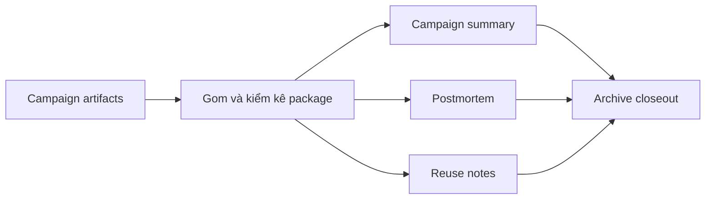

# Step 5: Archive

## Nhìn nhanh

| Thành phần | Nội dung |
| --- | --- |
| Mục tiêu | Khóa campaign thành package có thể audit và reuse |
| Decision owner | AI Archive Commander |
| Input chính | Concept, content, visuals, launch logs, monitoring notes |
| Output khóa | `campaign-summary.md`, `postmortem.md`, `reuse-notes.md` |

## Sơ đồ luồng



## Step này tồn tại để làm gì

Archive không phải phần phụ. Nó là nơi biến một campaign thành dữ liệu học lại cho campaign sau.

Nếu không archive, MEME LABS sẽ luôn phải bắt đầu lại gần như từ đầu vì:

- bài học nằm rải rác
- link quan trọng bị mất
- không ai còn nhớ campaign đã diễn ra ra sao

## Input của Step 5

Step 5 nhận:

- concept package
- content package
- launch package
- nếu có, cả package từ AI MEME FACTORY

## AI sẽ làm gì

### 1. Gom lại toàn bộ artifact

AI phải chắc rằng campaign không còn nằm rải rác ở nhiều nơi.

Nó cần gom:

- concept
- content
- launch fact
- post-launch note
- public loop note nếu có

### 2. Viết campaign summary

File này phải giúp một người chưa theo campaign từ đầu vẫn hiểu:

- coin là gì
- story chính là gì
- campaign đã chạy ra sao

Đây là lớp tóm tắt điều hành.

### 3. Viết postmortem

AI phải nhìn thẳng vào:

- cái gì chạy tốt
- cái gì không chạy tốt
- chỗ nào do narrative sai
- chỗ nào do concept yếu
- chỗ nào do content hoặc launch chưa đủ lực

### 4. Viết reuse notes

AI phải tách ra:

- cái gì có thể reuse
- kiểu hook nào đáng giữ
- visual language nào còn dùng lại được
- lesson nào nên biến thành rule cho lần sau

### 5. Viết closeout

Closeout là điểm chốt của archive.

Nó nói campaign đã được đóng hồ sơ và có thể đưa sang System Learning nếu cần.

## Output của Step 5

Toàn bộ output được lưu trong:

```text
.campaigns/[TICKER]/
```

Với các file:

- `campaign-summary.md`
- `postmortem.md`
- `reuse-notes.md`
- `step5-closeout.md`

## Mỗi file dùng để làm gì

### `campaign-summary.md`

Là file cho người xem nhanh.

### `postmortem.md`

Là file để mổ xẻ campaign.

### `reuse-notes.md`

Là file tách những gì còn giá trị cho campaign sau.

### `step5-closeout.md`

Là file đóng hồ sơ stage archive.

## Khi nào Step 5 được xem là xong

Step 5 chỉ được xem là hoàn tất khi:

1. campaign package đã đủ các file tối thiểu
2. campaign summary đọc vào hiểu ngay campaign là gì
3. postmortem nói rõ cái gì hiệu quả và không hiệu quả
4. reuse notes cho thấy campaign này để lại giá trị gì cho hệ thống

## Dấu hiệu Step 5 đang làm chưa tốt

- archive chỉ là nơi copy file chứ không có kết luận
- postmortem quá chung chung
- reuse notes không nói rõ reuse cái gì
- người đọc sau này vẫn phải hỏi lại campaign đã diễn ra thế nào

## Bàn giao cho bước sau

Step 5 là nơi tổng hợp bài học trước khi Step 7 dùng các bài học đó để vá hệ thống.

## Đọc thêm

- [Campaign Packages](/docs/outputs/campaign-packages)
- [Step 7: System Learning](/docs/stages/system-learning)
