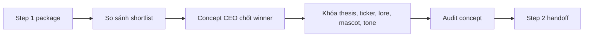

# Step 2: Concept Lab

## Nhìn nhanh

| Thành phần | Nội dung |
| --- | --- |
| Mục tiêu | Chốt đúng một narrative và khóa thành concept coin |
| Decision owner | AI Concept CEO |
| Input chính | `trend-package/`, `trend-final.md`, `batch-audit.md` |
| Output khóa | `selection.md`, `concept.md`, `concept-audit.md`, `step2-handoff.md` |

## Sơ đồ luồng



## Step này tồn tại để làm gì

Step 2 là nơi MEME LABS quyết định sẽ đánh câu chuyện nào.

Step 1 chỉ tạo ra nguyên liệu. Step 2 mới là nơi khóa bản sắc của coin. Nếu stage này yếu, các lỗi thường gặp sẽ là:

- concept không đủ khác biệt
- ticker mờ nhạt
- mascot không bám narrative
- content về sau bị generic
- launch angle quá giống các coin khác

## Input của Step 2

Step 2 bắt đầu khi package của Step 1 đã đủ rõ:

- `trend-final.md`
- `trend-package/`
- `batch-audit.md`
- `review-scope.md`
- `_index.md`
- các narrative đã được shortlist
- evidence review
- asset review

`x-public-log.json` và `x-public-log.md` có thể được dùng như public trust surface để
hiểu cộng đồng đã thấy gì, nhưng chúng không thay thế cho `trend-package/`.

Mục tiêu của input này là để AI Concept CEO không phải chọn story bằng cảm giác.

## AI sẽ làm gì

### 1. Đọc lại toàn bộ shortlist

AI phải nhìn lại toàn bộ các candidate còn sống trong batch và hiểu:

- narrative nào đang mạnh nhất
- narrative nào chỉ đáng giữ ở watchlist
- narrative nào có bằng chứng mạnh nhưng asset yếu
- narrative nào có asset vui nhưng thesis yếu

Đây là bước làm sạch ngữ cảnh trước khi chốt winner.

### 2. So sánh các candidate trên cùng một mặt bằng

AI phải đặt các candidate lên cùng một bảng so sánh:

- độ bám narrative
- độ mới
- độ vui
- độ dễ hiểu với cộng đồng
- độ dễ biến thành mascot
- độ dễ viết hook, thread, reply
- độ hợp để launch ngay

Mục tiêu là biến quyết định từ cảm tính sang có logic.

### 3. AI Concept CEO chốt một winner duy nhất

Đây là gate quan trọng nhất của Step 2.

AI phải trả lời rõ:

- narrative nào thắng
- vì sao nó thắng
- vì sao các narrative còn lại thua
- rủi ro lớn nhất của decision này là gì

Không được để kết luận kiểu “cả hai đều ổn”.

### 4. Dựng concept coin

Sau khi winner đã được chốt, AI mới dựng concept:

- thesis
- ticker
- lore
- mascot
- tone
- launch angle

Concept phải khiến người đọc hiểu ngay:

- coin này là ai
- nó sống nhờ story nào
- nó nói giọng gì
- nó định kéo cộng đồng bằng điểm vui nào

### 5. Tự audit lại concept

Sau khi dựng xong, AI phải tự review:

- concept có còn bám narrative không
- có bị generic không
- có đủ vui không
- ticker có đủ nhớ không
- mascot có đủ mạnh để ra visual không
- concept có đủ rõ để dựng content system không

Nếu câu trả lời còn mơ hồ, Step 2 chưa được coi là hoàn tất.

### 6. Viết handoff cho Step 3

Step 3 không nên phải quay lại đọc toàn bộ Step 1.

Handoff của Step 2 phải đủ rõ để content team biết:

- đang kể câu chuyện nào
- tone của coin là gì
- mascot là ai
- điểm fun nhất nằm ở đâu
- trục content đầu tiên nên xoáy vào cái gì

## Output của Step 2

Toàn bộ output được lưu trong:

```text
.concepts/[TICKER]/
```

Với các file:

- `selection.md`
- `concept.md`
- `concept-audit.md`
- `step2-handoff.md`

## Mỗi file dùng để làm gì

### `selection.md`

Là file quyết định.

Nó dùng để trả lời:

- winner là ai
- vì sao nó thắng
- các candidate còn lại bị loại vì lý do gì

### `concept.md`

Là bản mô tả concept chính thức của coin.

### `concept-audit.md`

Là lớp tự kiểm tra để chặn concept generic, lệch narrative, hoặc không launchable.

### `step2-handoff.md`

Là file bàn giao cho Step 3.

## Khi nào Step 2 được xem là xong

Step 2 chỉ được xem là hoàn tất khi:

1. đã có đúng một winner
2. concept package đã đủ bốn file
3. concept audit không còn flag nghiêm trọng
4. Step 3 có thể bắt đầu mà không cần hidden operator context

## Dấu hiệu Step 2 đang làm chưa tốt

- ticker nghe như coin cũ
- lore dài nhưng không có hình ảnh trung tâm
- mascot không đủ mạnh để ra poster hoặc short
- tone không rõ là degen, cult, ironic hay pseudo-serious
- launch angle mơ hồ
- Step 3 đọc package xong vẫn phải hỏi “vậy coin này thực ra là gì”

## Bàn giao cho bước sau

Step 2 không tạo content.

Nó tạo ra bản sắc đủ rõ để Step 3 biến thành content system.

## Đọc thêm

- [Concept Packages](/docs/outputs/concept-packages)
- [Step 3: Content Creator](/docs/stages/content-creator)
