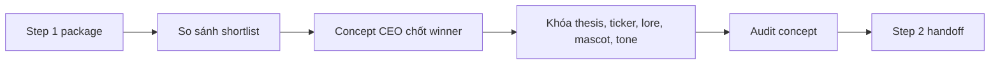

# Step 2: Concept Lab

## Nhìn nhanh

| Thành phần | Nội dung |
| --- | --- |
| Mục tiêu | Chốt đúng một narrative và khóa thành concept coin |
| Decision owner | AI Concept CEO |
| Input chính | `step1-handoff.md`, `batch-audit.md`, shortlist narratives |
| Output khóa | `selection.md`, `concept.md`, `concept-audit.md` |

## Sơ đồ luồng

## Step này tồn tại để làm gì

Step 2 tồn tại để chọn đúng một narrative và khóa nó thành một concept coin đủ rõ để content team và launch team cùng bám vào.

Nếu Step 2 yếu, hệ quả thường là:

- concept không đủ khác biệt
- ticker mờ nhạt
- mascot không bám narrative
- content không có trục rõ ràng
- launch angle bị generic

## Input của Step 2

Step 2 đọc lại package mà Step 1 đã bàn giao:

- `step1-handoff.md`
- `batch-audit.md`
- `review-scope.md`
- `_index.md`
- shortlisted narratives
- evidence review
- asset review

## AI sẽ làm gì

## 1. Đọc lại toàn bộ package của Step 1

AI cần hiểu rõ narrative nào có lực thật, narrative nào chỉ có bề mặt, narrative nào không nên đi tiếp.

## 2. AI Concept CEO chốt một winner duy nhất

Đây là gate quan trọng nhất của Step 2.

AI Concept CEO phải đưa ra quyết định rõ:

- narrative nào thắng
- tại sao nó thắng
- tại sao các narrative còn lại bị loại

Mục đích là ép cả hệ thống tập trung vào một story duy nhất.

## 3. Khóa concept coin

AI biến winner thành một concept hoàn chỉnh:

- thesis
- ticker
- lore
- mascot
- tone
- launch angle
- cult seed

## 4. Audit concept

AI tự review lại concept để trả lời:

- concept có bám narrative không
- có đủ độc đáo không
- có đủ fun không
- có đủ rõ để xây content system không
- có đủ launchable không

## 5. Viết handoff sang Step 3

Step 3 không nên phải đọc lại Step 1.

Handoff của Step 2 cần đủ rõ để team content biết:

- đang kể câu chuyện nào
- tone của coin là gì
- mascot là ai
- điểm nào là điểm fun nhất để đẩy content

## Output của Step 2

Một concept package đầy đủ phải có:

- `selection.md`
- `concept.md`
- `concept-audit.md`
- `step2-handoff.md`

## Lưu vào đâu

Tất cả output của Step 2 được lưu trong `.concepts/[TICKER]/`.

## Khi nào Step 2 được xem là xong

Step 2 chỉ được xem là xong khi:

- AI CEO đã chốt một winner duy nhất
- concept package đã đủ bốn file
- concept audit đã pass
- handoff đã đủ rõ để sang content

## Đọc thêm

- [Concept packages](/docs/outputs/concept-packages)
- [Step 3: Content Creator](/docs/stages/content-creator)
