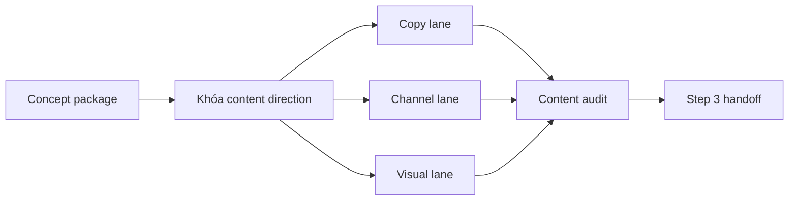

# Step 3: Content Creator

## Nhìn nhanh

| Thành phần | Nội dung |
| --- | --- |
| Mục tiêu | Biến concept thành content system có thể ra công khai |
| Decision owner | AI Content CEO |
| Input chính | `selection.md`, `concept.md`, `concept-audit.md`, `step2-handoff.md` |
| Output khóa | `copy-pack.md`, `channel-pack.md`, `visual-pack.md`, `content-audit.md` |

## Sơ đồ luồng



## Step này tồn tại để làm gì

Step 3 tồn tại để biến một concept coin thành một hệ content có thể sống công khai.

Nếu Step 2 trả lời “coin này là ai”, thì Step 3 trả lời “coin này sẽ xuất hiện trước cộng đồng như thế nào”.

Đây là bước biến idea thành:

- copy có thể đăng
- identity có thể nhận ra
- mascot có thể lặp lại
- visual có thể mở rộng
- short-form asset có thể nuôi attention

## Input của Step 3

Step 3 nhận từ Step 2:

- `selection.md`
- `concept.md`
- `concept-audit.md`
- `step2-handoff.md`

Mục tiêu là để content team không phải đoán lại narrative hay tone.

## AI sẽ làm gì

### 1. Khóa content direction

AI Content CEO phải chốt:

- content phải làm người xem cảm thấy gì
- hook trung tâm là gì
- coin này nên được nhớ bằng hình ảnh nào
- lane nào là lane chính của campaign

Đây là bước giữ cho copy, channel và visual cùng kể một câu chuyện.

### 2. Dựng copy lane

AI viết ra:

- hero tweet
- thread nếu cần
- reply pack
- copypasta

Copy không chỉ cần đúng narrative, mà còn phải có lực CT.

### 3. Dựng channel lane

AI quyết định cách coin tồn tại trên X:

- bio hoặc description
- pinned direction
- community angle
- rule giọng điệu
- loại post nào được ưu tiên

Đây là nơi biến concept thành social presence.

### 4. Dựng visual lane

AI xác định:

- key visual
- poster direction
- reaction image direction
- mascot board
- short board hoặc video board nếu campaign cần media mạnh

Mục tiêu là để mọi asset về sau đều cùng một thế giới.

### 5. Audit lại content system

Trước khi sang launch, AI phải tự review:

- có bám narrative không
- có đủ fun không
- có đủ độc đáo không
- có bị generic meme marketing không
- có đủ launch-ready không

Nếu còn lệch, Step 3 phải sửa ngay trong stage này.

### 6. Viết handoff cho Step 4

Launch Ops phải đọc package là biết:

- post nào dùng để mở màn
- visual nào đi cùng launch
- tone nào cần giữ trong giờ đầu

## Output của Step 3

Toàn bộ output được lưu trong:

```text
.campaigns/[TICKER]/content-system/
```

Với các file:

- `content-direction.md`
- `copy-pack.md`
- `channel-pack.md`
- `visual-pack.md`
- `content-audit.md`
- `step3-handoff.md`

## Mỗi file dùng để làm gì

### `content-direction.md`

Khóa định hướng cho toàn bộ stage.

### `copy-pack.md`

Là kho chữ để launch và nuôi coin.

### `channel-pack.md`

Là bản mô tả surface của coin trên X và community.

### `visual-pack.md`

Là định hướng visual để poster, still, clip, mascot board không bị rời rạc.

### `content-audit.md`

Là gate chặn content generic, lệch narrative, hoặc chưa đủ lực để đi ra công khai.

### `step3-handoff.md`

Là bản bàn giao cho Launch Ops.

## Khi nào Step 3 được xem là xong

Step 3 chỉ được xem là hoàn tất khi:

1. content system đã đủ sáu file
2. tone đã nhất quán
3. visual direction đã rõ
4. identity trên X có thể dựng được
5. `content-audit.md` đã pass
6. Step 4 có thể launch mà không cần tự vá identity

## Dấu hiệu Step 3 đang làm chưa tốt

- copy vui nhưng không giống concept
- visual đẹp nhưng generic
- channel pack không nói rõ account sẽ cư xử ra sao
- không có post mở màn đủ mạnh
- mascot board có nhưng không tạo được cảm giác muốn follow

## Bàn giao cho bước sau

Step 3 không launch.

Nó chuẩn bị mọi thứ để Step 4 có thể launch nhanh, đúng giọng, và có đủ asset để phản ứng ngay sau launch.

## Đọc thêm

- [Campaign Packages](/docs/outputs/campaign-packages)
- [Step 4: Launch Ops](/docs/stages/launch-ops)
