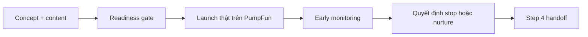

# Step 4: Launch Ops

## Nhìn nhanh

| Thành phần | Nội dung |
| --- | --- |
| Mục tiêu | Launch token thật và đọc phản ứng thật sau launch |
| Decision owner | AI Launch Commander |
| Input chính | Concept package, content đã approve, launch readiness |
| Output khóa | `launch-readiness.md`, `launch-metadata.md`, `launch-decision.md` |

## Sơ đồ luồng



## Step này tồn tại để làm gì

Step 4 là ranh giới giữa planning và execution.

Tất cả các stage trước đó đều chuẩn bị cho khoảnh khắc này:

- story đã chọn
- concept đã khóa
- content đã sẵn

Step 4 tồn tại để biến chúng thành một launch có thật, có dấu vết, có log, và có quyết định rõ sau launch.

## Input của Step 4

Step 4 thường cần:

- concept package đã khóa
- content package đã approve
- launch angle rõ ràng
- readiness cho PumpFun

## AI sẽ làm gì

### 1. Chốt launch readiness

AI phải trả lời:

- concept đã rõ chưa
- post mở màn đã sẵn chưa
- visual mở màn đã sẵn chưa
- metadata launch đã rõ chưa
- có gì còn thiếu trước khi bấm launch không

Nếu launch chưa sẵn sàng, Step 4 không được tự lấp chỗ trống bằng suy đoán.

### 2. Launch token

Đây là bước execution thật.

AI cần ghi lại:

- launch diễn ra lúc nào
- mint nào được tạo ra
- link nào được dùng để theo dõi

Mục tiêu của stage này không phải là làm đẹp câu chuyện, mà là ghi fact.

### 3. Ghi launch metadata

Sau launch, AI phải để lại một record đủ rõ:

- token gì đã được launch
- lúc nào
- ở đâu
- link nào liên quan

Để campaign không rơi vào trạng thái “đã launch rồi nhưng không biết mở hồ sơ nào để xem”.

### 4. Theo dõi early reaction

AI phải nhìn phản ứng sớm:

- community có phản hồi không
- content mở màn có kéo attention không
- launch có tạo được năng lượng ban đầu không
- có tín hiệu cho thấy nên nuôi tiếp không

Đây là lớp đọc sự thật, không phải lớp tự trấn an.

### 5. Ra launch decision

AI phải chốt một trong hai:

- dừng ở đây và chuyển archive
- hoặc mở đường sang AI MEME FACTORY để nuôi tiếp

Decision phải được giải thích, không phải chỉ gắn nhãn.

### 6. Viết handoff cho bước sau

Nếu dừng, handoff sang Archive phải đủ rõ.

Nếu nuôi tiếp, handoff phải cho thấy:

- vì sao coin còn đáng nuôi
- content loop nên bắt đầu bằng trục nào

## Output của Step 4

Toàn bộ output được lưu trong:

```text
.campaigns/[TICKER]/launch/
```

Với các file:

- `launch-readiness.md`
- `launch-metadata.md`
- `monitoring-notes.md`
- `launch-decision.md`
- `step4-handoff.md`

## Mỗi file dùng để làm gì

### `launch-readiness.md`

Là file chốt trước launch: có được phép launch chưa.

### `launch-metadata.md`

Là nơi lưu fact của launch.

### `monitoring-notes.md`

Là nơi ghi lại phản ứng thật sau launch.

### `launch-decision.md`

Là file quyết định có đi tiếp sang Step 6 hay không.

### `step4-handoff.md`

Là file bàn giao sang Archive hoặc AI MEME FACTORY.

## Khi nào Step 4 được xem là xong

Step 4 chỉ được xem là hoàn tất khi:

1. launch package đã tồn tại
2. launch fact đã được ghi lại
3. early reaction đã được đọc và viết ra
4. decision sau launch đã được chốt rõ

## Không thuộc plan chuẩn

Những thứ sau không phải logic mặc định của workflow:

- fake traction
- bundle buy để diễn
- self-snipe để làm đẹp launch
- tự tạo volume giả để ép sang loop tiếp theo

## Dấu hiệu Step 4 đang làm chưa tốt

- launch rồi nhưng metadata quá ít
- không ghi được vì sao coin được nuôi tiếp hoặc bị dừng
- monitoring note chỉ là cảm nhận mơ hồ
- archive đọc lại không hiểu launch thực tế đã diễn ra như thế nào

## Bàn giao cho bước sau

Step 4 là điểm rẽ:

- coin chết hoặc launch yếu thì sang Archive
- coin còn sống và còn attention thì sang AI MEME FACTORY

## Đọc thêm

- [Campaign Packages](/docs/outputs/campaign-packages)
- [Step 6: AI MEME FACTORY](/docs/stages/ai-meme-factory)
