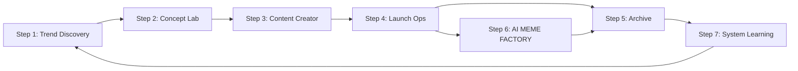
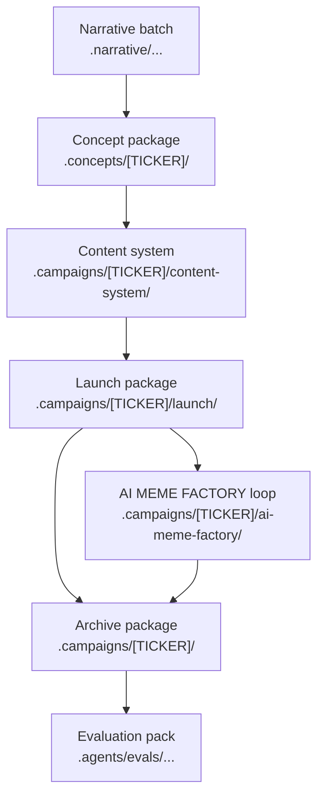

# Tổng quan pipeline

MEME LABS hiện chạy theo 7 giai đoạn, trong đó Step 6 là loop song song và Step 7 là meta-learning stage.

## Nhìn nhanh toàn hệ thống

| Stage | Mục tiêu chính | Artifact khóa |
| --- | --- | --- |
| Step 1 | Tạo batch narrative đủ tốt để chọn winner | `.narrative/.../step1-handoff.md` |
| Step 2 | Chốt một narrative và khóa thành concept coin | `.concepts/[TICKER]/concept.md` |
| Step 3 | Biến concept thành content system có thể ra công khai | `.campaigns/[TICKER]/content-system/` |
| Step 4 | Launch token thật và đọc phản ứng thật | `.campaigns/[TICKER]/launch/` |
| Step 5 | Archive campaign để audit và reuse | `.campaigns/[TICKER]/` |
| Step 6 | Nuôi loop công khai trên X nếu coin còn sống | `.campaigns/[TICKER]/ai-meme-factory/` |
| Step 7 | Học lại để vá workflow và skill | `.agents/evals/YYYYMMDD-HHmm-scope/` |

## Sơ đồ vận hành

## Nhìn theo luồng artifact

## Stage 1. Trend Discovery

### Mục đích

Tạo ra một batch narrative mới đủ rõ để hệ thống có nguyên liệu chọn winner.

### Input

- tín hiệu thị trường
- raw trend scan
- evidence ban đầu
- asset pack ban đầu

### Output

- narrative batch trong `.narrative/`
- review scope
- evidence review
- asset review
- batch audit
- handoff sang Step 2

## Stage 2. Concept Lab

### Mục đích

Chọn đúng một narrative và khóa nó thành concept coin.

### Input

- step1 handoff
- batch audit
- shortlisted narratives
- evidence review
- asset review

### Output

- concept package trong `.concepts/[TICKER]/`

## Stage 3. Content Creator

### Mục đích

Biến concept thành một content system có thể sống công khai.

### Input

- concept package
- mascot direction
- tone và cult thesis

### Output

- hero post
- thread
- reply pack
- identity pack cho X
- visual assets
- short-form assets khi cần

## Stage 4. Launch Ops

### Mục đích

Launch token thật và đọc phản ứng thật sau launch.

### Input

- concept package
- approved content
- launch readiness

### Output

- launch metadata
- monitoring notes
- quyết định dừng hay nuôi tiếp

## Stage 5. Archive

### Mục đích

Lưu lại toàn bộ chiến dịch để audit, học lại và reuse.

### Input

- concept
- content
- media
- launch logs
- monitoring notes

### Output

- campaign package trong `.campaigns/[TICKER]/`

## Stage 6. AI MEME FACTORY

### Mục đích

Vận hành loop công khai trên X để cho cộng đồng thấy AI đang tự chạy thật.

### Input

- launch package
- content package
- public rules của AI MEME FACTORY

### Output

- loop package trong `.campaigns/[TICKER]/ai-meme-factory/`

## Stage 7. System Learning

### Mục đích

Đưa bài học từ các campaign đã chạy ngược trở lại control plane của MEME LABS.

### Input

- recent campaign artifacts
- failure patterns lặp lại
- output yếu hoặc không ổn định

### Output

- evaluation pack trong `.agents/evals/YYYYMMDD-HHmm-scope/`

## Operating rule quan trọng nhất

Chỉ nên có một narrative đi trọn pipeline tại một thời điểm.

Nếu discovery chưa xong, không sang concept.

Nếu concept chưa khóa, không sang content.

Nếu content chưa đạt, không sang launch.

Nếu launch chưa xong, không bỏ qua archive.

Nếu chưa chốt được bài học hệ thống, không nên gọi pipeline là đã trưởng thành hơn.
