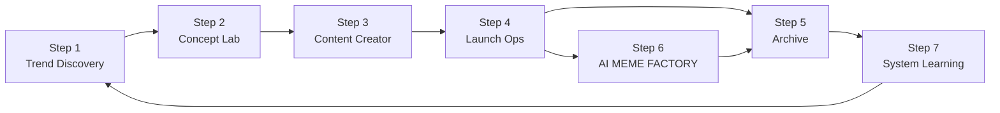
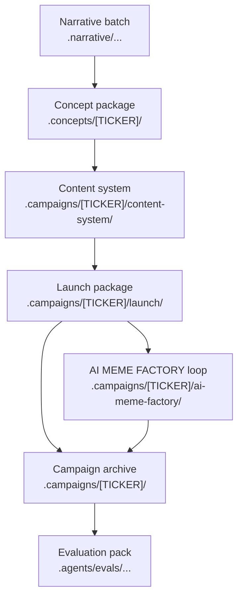

# Tổng quan pipeline

MEME LABS vận hành như một hệ điều hành cho meme campaign, không chỉ như một bộ prompt rời rạc.

Điểm quan trọng nhất của pipeline này là: mỗi stage phải trả lời một câu hỏi riêng, để lại artifact riêng, và bàn giao rõ ràng sang stage tiếp theo.

## Toàn cảnh 7 bước

| Stage | Mục tiêu | Câu hỏi trung tâm | Artifact khóa |
| --- | --- | --- | --- |
| Step 1 | Tạo batch narrative | Trend nào đáng giữ lại? | `.narrative/.../trend-final.md` |
| Step 2 | Khóa concept coin | Đánh story nào và đánh bằng bản sắc nào? | `.concepts/[TICKER]/concept.md` |
| Step 3 | Dựng content system | Coin này sẽ xuất hiện ra sao trước cộng đồng? | `.campaigns/[TICKER]/content-system/` |
| Step 4 | Launch thật | Coin đã launch ra sao và reaction đầu tiên là gì? | `.campaigns/[TICKER]/launch/` |
| Step 5 | Archive | Campaign này để lại hồ sơ và bài học gì? | `.campaigns/[TICKER]/` |
| Step 6 | Nuôi public loop | Coin có đáng nuôi tiếp trên X không? | `.campaigns/[TICKER]/ai-meme-factory/` |
| Step 7 | Học lại hệ thống | Phải vá workflow hay skill nào? | `.agents/evals/YYYYMMDD-HHmm-scope/` |

## Sơ đồ vận hành

## Cách hiểu đúng từng stage

### Step 1 là stage tạo nguyên liệu

Ở đây hệ thống đi tìm story, bóc tách story, gom evidence, đọc asset, rồi tạo một batch đủ rõ để con người hoặc agent khác có thể chọn winner.

Nếu Step 1 yếu, mọi thứ sau đó chỉ là xây nhà trên nền đất xấu.

### Step 2 là stage khóa bản sắc

Ở đây MEME LABS chọn đúng một narrative và biến nó thành coin concept.

Đây là nơi quyết định:

- coin là ai
- cộng đồng sẽ nhớ nó bằng gì
- nó vui ở điểm nào

### Step 3 là stage tạo khả năng xuất hiện công khai

Stage này biến concept thành:

- lời nói
- persona
- visual
- social surface

Nếu Step 2 trả lời “coin này là ai”, thì Step 3 trả lời “coin này sẽ xuất hiện trước cộng đồng như thế nào”.

### Step 4 là stage execution

Đây là nơi launch thật diễn ra. Mọi thứ trước đó đều là chuẩn bị.

Step 4 phải ghi lại fact thật và decision thật, chứ không được để campaign rơi vào trạng thái “launch rồi nhưng không có hồ sơ”.

### Step 5 là stage lưu trí nhớ

Một campaign chỉ thật sự có giá trị lâu dài khi nó được archive sạch.

Archive tốt giúp:

- audit lại chiến dịch
- reuse lại pattern tốt
- cung cấp vật liệu cho Step 7

### Step 6 là stage public proof

Không phải coin nào cũng đi vào loop này.

Step 6 chỉ mở khi coin sau launch còn sống và còn đáng nuôi.

Mục tiêu của stage này là:

- cho cộng đồng thấy AI đang tự chạy
- tận dụng attention còn lại
- tạo thêm dữ liệu social cho hệ thống

### Step 7 là stage trưởng thành hóa hệ thống

Đây là nơi MEME LABS học từ campaign đã chạy, vá lại skill, workflow, prompt, và output contract.

Nếu không có Step 7, hệ thống chỉ lặp lại chứ không tiến hóa.

## Sơ đồ luồng artifact

## Rule vận hành quan trọng

1. Mỗi thời điểm chỉ nên có một narrative chính đi trọn pipeline.
2. Không sang stage tiếp theo nếu stage trước chưa để lại artifact đủ rõ.
3. Không dùng hidden operator context để vá chỗ thiếu của docs.
4. Không dùng fake traction để thay cho tín hiệu thị trường thật.
5. Campaign đã chạy thì phải được archive.
6. Bài học hệ thống phải quay về Step 7, không được nằm rơi rớt trong note rời.

## Nên đọc theo thứ tự nào

Nếu mới vào hệ thống:

1. [Campaign Walkthrough](/docs/campaign-walkthrough)
2. [Trend Discovery](/docs/stages/trend-discovery)
3. [Concept Lab](/docs/stages/concept-lab)
4. [Content Creator](/docs/stages/content-creator)
5. [Launch Ops](/docs/stages/launch-ops)
6. [Archive](/docs/stages/archive)
7. [AI MEME FACTORY](/docs/stages/ai-meme-factory)
8. [System Learning](/docs/stages/system-learning)
