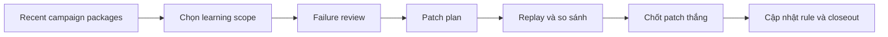

# Step 7: System Learning

## Nhìn nhanh

| Thành phần | Nội dung |
| --- | --- |
| Mục tiêu | Học lại từ campaign thật để vá workflow và skill |
| Decision owner | Learning Commander |
| Input chính | Campaign packages gần đây, failure notes, weak outputs |
| Output khóa | `training-brief.md`, `patch-plan.md`, `winner.md` |

## Sơ đồ luồng



## Step này tồn tại để làm gì

Step 7 là stage khiến MEME LABS trưởng thành hơn theo thời gian.

Nếu hệ thống chỉ chạy campaign mà không học lại, nó sẽ lặp lại cùng một lỗi. Stage này tồn tại để:

- gom bài học từ campaign thật
- xác định lỗi lặp lại
- viết patch plan
- chọn patch thắng
- đưa patch đó quay lại control plane

## Input của Step 7

Step 7 thường cần:

- campaign packages gần đây
- failure notes lặp lại
- các output yếu hoặc không ổn định
- stage artifacts từ Step 1 đến Step 6

## AI sẽ làm gì

### 1. Chọn scope training

AI không nên học mọi thứ cùng lúc.

Nó phải chọn một scope đủ hẹp, ví dụ:

- Step 1 đang chọn narrative yếu
- Step 2 đang ra concept generic
- Step 3 đang làm visual pack không đủ mạnh

### 2. Gom case thật

AI lấy các case đại diện cho scope đó:

- case tốt
- case xấu
- case trung gian

Mục tiêu là có đủ vật liệu để so sánh, không học từ một campaign đơn lẻ.

### 3. Mổ lỗi

AI phải trả lời:

- lỗi nằm ở đâu
- lỗi có lặp lại không
- lỗi là do prompt, workflow, skill hay output contract

### 4. Viết patch plan

Patch plan không chỉ nói “cần cải thiện”.

Nó phải nói rõ:

- sửa file nào
- sửa logic nào
- thay đổi đó kỳ vọng cải thiện điều gì

### 5. Chốt winner

Sau khi review, AI phải chốt:

- patch nào đáng giữ
- patch nào nên bỏ
- có rule mới nào cần cập nhật vào hệ thống

### 6. Viết closeout

Đây là điểm khép lại vòng học và mở đường cho vòng vận hành sau.

## Output của Step 7

Toàn bộ output được lưu trong:

```text
.agents/evals/YYYYMMDD-HHmm-scope/
```

Với các file:

- `training-brief.md`
- `failure-review.md`
- `patch-plan.md`
- `winner.md`
- `step7-closeout.md`

## Mỗi file dùng để làm gì

### `training-brief.md`

Xác định scope học.

### `failure-review.md`

Giải thích hệ thống đang hỏng ở đâu.

### `patch-plan.md`

Liệt kê các patch đáng thử.

### `winner.md`

Chốt patch nào thắng và vì sao.

### `step7-closeout.md`

Đóng vòng học để hệ thống bước sang chu kỳ mới.

## Khi nào Step 7 được xem là xong

Step 7 chỉ được xem là hoàn tất khi:

1. training scope đủ hẹp
2. failure pattern đã được mô tả rõ
3. patch plan đủ cụ thể để thực hiện
4. winner đã được chốt
5. closeout đã hoàn tất

## Dấu hiệu Step 7 đang làm chưa tốt

- học quá rộng, không patch nổi
- chỉ nói bài học chung chung
- không chỉ ra file hay logic nào cần sửa
- có winner nhưng không giải thích tại sao thắng

## Bàn giao cho vòng mới

Kết quả của Step 7 phải quay lại workflow và skill, để vòng campaign sau chạy tốt hơn vòng trước.

## Đọc thêm

- [Evaluation Packs](/docs/outputs/evaluation-packs)
- [Campaign Walkthrough](/docs/campaign-walkthrough)
