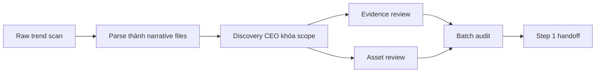

# Step 1: Trend Discovery

## Nhìn nhanh

| Thành phần | Nội dung |
| --- | --- |
| Mục tiêu | Tạo ra một narrative batch đủ tốt để Step 2 chọn winner |
| Decision owner | AI Discovery CEO |
| Input chính | Raw trend scan, evidence ban đầu, asset ban đầu |
| Output khóa | `review-scope.md`, `batch-audit.md`, `step1-handoff.md` |

## Sơ đồ luồng



## Step này tồn tại để làm gì

Step 1 tồn tại để tạo ra một narrative batch đủ tốt cho Step 2.

Nếu Step 1 yếu, toàn bộ phần sau rất dễ:

- chọn nhầm winner
- khóa concept lệch story
- làm content generic
- launch một coin không có lực thật

## Input của Step 1

Step 1 bắt đầu từ các tín hiệu thô:

- trend đang nóng
- raw story scan
- evidence ban đầu như link, ảnh, video, tweet, asset
- các rule đánh giá narrative
- các rule đánh giá asset

## AI sẽ làm gì

## 1. Quét và gom trend thô

AI nhìn vào bề mặt attention hiện tại để gom ra một raw report.

Mục tiêu của đoạn này không phải là kết luận winner, mà là tạo đủ vật liệu ban đầu.

## 2. Parse ra từng narrative riêng

AI tách raw report thành các narrative files độc lập để có thể review từng story riêng.

Mỗi narrative sau bước này cần đủ rõ để có thể chấm tiếp.

## 3. AI Discovery CEO khóa scope review

Đây là decision gate đầu tiên.

AI Discovery CEO quyết định:

- narrative nào được review sâu
- narrative nào chỉ để watchlist
- narrative nào nên dừng luôn

Mục tiêu của gate này là bảo vệ thời gian của các agent review phía sau.

## 4. Review evidence pack

AI đọc bằng chứng của narrative được chọn để trả lời:

- narrative này có lực thật không
- có đang được cộng đồng nói tới thật không
- case study có đáng tin không
- có đủ độ nóng để đi tiếp không

## 5. Review asset pack

AI không chỉ gom asset, mà còn phải hiểu asset.

Nó phải trả lời:

- asset này đang nói gì
- ý nghĩa của asset là gì
- asset này có bám narrative không
- asset này có đủ vui không
- asset này có đủ độc đáo không
- asset này có usable cho content downstream không

## 6. Audit toàn batch

Sau khi có review, AI nhìn lại cả batch để:

- xếp hạng lại narratives
- xác nhận batch có đủ tốt để review buổi tối hay chưa
- nêu rõ batch này mạnh ở đâu, yếu ở đâu

## 7. Viết handoff sang Step 2

Mục tiêu là để Step 2 không phải đọc lại toàn bộ batch từ đầu.

Handoff phải đủ rõ để cho biết:

- winner candidates là ai
- tại sao candidate này đáng đi tiếp
- đâu là điểm cần cẩn trọng

## Output của Step 1

Một batch hoàn chỉnh của Step 1 phải có:

- raw report
- `_index.md`
- narrative files
- `review-scope.md`
- `*.evidence.md`
- `*.evidence-review.md`
- `*.assets/`
- `*.asset-review.md`
- `batch-audit.md`
- `step1-handoff.md`

## Lưu vào đâu

Tất cả output của Step 1 được lưu trong `.narrative/`.

Đơn vị làm việc chuẩn là một parsed batch folder, ví dụ:

```text
.narrative/global/trend-YYYYMMDD-HHmm/raw-01/
```

hoặc:

```text
.narrative/ai/ai-YYYYMMDD-HHmm/raw-01/
```

## Khi nào Step 1 được xem là xong

Step 1 chỉ được xem là xong khi:

- batch đã có narrative rõ ràng
- scope review đã được khóa
- narrative trọng điểm đã có evidence review
- narrative trọng điểm đã có asset review
- batch đã có audit
- batch đã có handoff
- batch có thể được gọi là `review-ready`

## Đọc thêm

- [Step 1 Orchestration](/docs/automation/step-1-orchestration)
- [Narrative batches](/docs/outputs/narrative-batches)
- [Night Review](/docs/operations/night-review)
