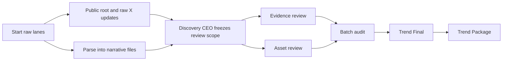

# Step 1: Trend Discovery

## Quick view

| Item | Meaning |
| --- | --- |
| Goal | Build a narrative batch that is strong enough for Step 2 to choose a winner |
| Decision owner | Discovery CEO |
| Core outputs | `review-scope.md`, `batch-audit.md`, `trend-final.md`, `trend-package/` |
| Public trust layer | optional `x-public-log.*` plus Stage 1 X posts |

## Flow

## What this step is for

Stage 1 exists to create a clean narrative batch for the rest of MEME LABS.

If Stage 1 is weak:

- Step 2 locks the wrong concept
- Step 3 builds content on weak story logic
- Step 4 launches something that never had real narrative force

## What AI does in this step

### 1. Scan for raw narratives

AI uses the browser-based Grok pipeline to collect current market stories.

### 2. Parse the raw reports

AI normalizes the raw report into one file per narrative plus one `_index.md`.

### 3. Freeze review scope

Discovery CEO decides:

- which narratives deserve deeper review now
- which ones stay on watchlist
- which ones should be dropped

### 4. Review evidence

Approved narratives are checked for:

- source directness
- freshness
- propagation
- support clarity
- whether the narrative is really alive

### 5. Review assets

Approved narratives are also checked for:

- narrative fit
- meaning
- meme potential
- uniqueness
- content usability

### 6. Audit the batch

The batch auditor decides whether the batch is actually ready for Step 2.

### 7. Freeze Trend Final

AI writes:

- `trend-final.md`
- `trend-package/`

`trend-final.md` is the decision surface.
`trend-package/` is the real handoff package for Step 2.

## Outputs

A complete Stage 1 batch may contain:

- raw reports
- `_index.md`
- narrative files
- `review-scope.md`
- `*.evidence.md`
- `*.assets/`
- `*.evidence-review.md`
- `*.asset-review.md`
- `batch-audit.md`
- `trend-final.md`
- `trend-package/`
- optional `x-public-log.json`
- optional `x-public-log.md`

## Internal flow vs public X flow

Stage 1 has two surfaces:

- internal artifact flow for Step 2
- optional public X trust flow for external observers

The public X layer explains what AI is doing in real time.
It does not replace `trend-package/`.

## Public X event order

When public logging is enabled, the public order is:

1. one root run post
2. one raw narrative reply for each completed raw lane
3. one parsed narrative summary subthread for each approved narrative
4. one Discovery CEO reply inside each approved narrative subthread
5. one evidence review reply
6. one asset review reply
7. one batch audit reply under the root run post
8. one separate top-level Trend Final thread

This is a trust surface, not the Step 2 handoff.

The public X layer now runs as an ordered async mirror queue. Internal review
keeps moving while the trust thread catches up in the background.

## Empty-state is valid

Stage 1 can finish with no valid winner.

That is still a valid result when:

- the market is quiet
- no fresh trigger clears the threshold
- the batch is too weak and should be rerun

## Related docs

- [Step 1 Orchestration](/docs/automation/step-1-orchestration)
- [Narrative Batches](/docs/outputs/narrative-batches)
- [Night Review](/docs/operations/night-review)
