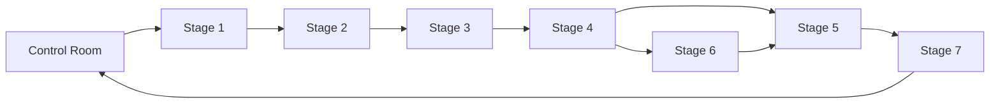

# MEME LABS

MEME LABS is a campaign-first agent operating system.

It turns a loose workspace of skills, workflows, scripts, and artifacts into a
live operating desk:

- one Control Room
- one campaign board
- one clear owner per stage
- one durable artifact trail

## What makes it different

- filesystem artifacts stay canonical
- the app is a control plane, not a hidden database
- Stage 1 is still the default opening move
- launch and risky actions stay human-gated

## Start here

1. [Introduction](/docs/introduction)
2. [Quickstart](/docs/quickstart)
3. [Control Room](/docs/operations/control-room)
4. [Pipeline Overview](/docs/stages/overview)

## The live loop

